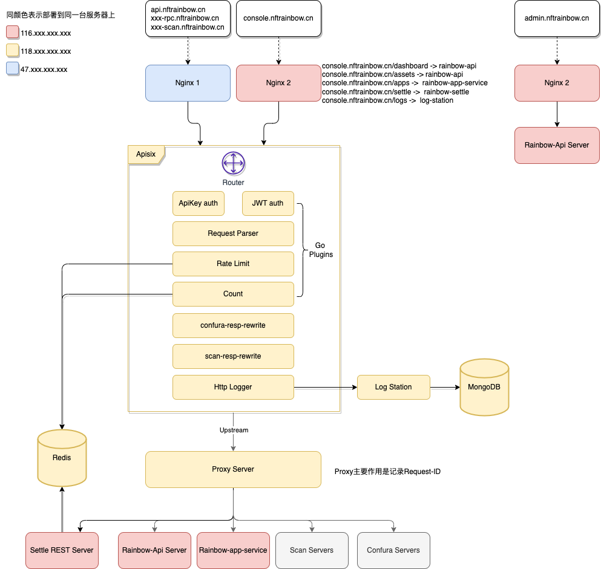

# 法币网关部署流程

## 架构图


## 安装
- 安装Redis
  - 关闭保护模式以接收来自docker实例的连接
- 安装Mongodb
- 安装Docker

## Apisix部署及配置
1. 创建 apisix config 文件, 路径 `apisix-docker/apisix_conf/config.yaml`，可参考`cmd/go-runner/plugins/config-sample.yaml`
2. 执行命令 `make deploy` 部署 ，该命令会
   1. 编译 `apisix-go-plugin-runner`
   2. 启动 docker compose
3. 配置路由
   1. 参考routers_sample.sh 创建 router.sh 脚本，只需要修改 域名和IP 变量
   2. 运行配置 `sh routers.sh`
   
## Nginx配置

参看架构图，Nginx有2台服务器

### Nginx1
代理的api包含 rainbow-api/scan/confura，将所有相关域名proxy pass到 apisix 服务即可(端口9080)
  
```nginx
  server {
    server_name devapi.nftrainbow.me dev-rpc-cspace-main.nftrainbow.me dev-rpc-cspace-test.nftrainbow.me dev-rpc-espace-main.nftrainbow.me dev-rpc-espace-test.nftrainbow.me dev-scan-cspace-main.nftrainbow.me dev-scan-cspace-test.nftrainbow.me dev-scan-espace-main.nftrainbow.me dev-scan-espace-test.nftrainbow.me;
    listen 443;
    client_max_body_size 10M;


    location / {
            proxy_pass http://apisix-backend:9080;
            proxy_http_version 1.1;
            proxy_buffering off;
            error_page 405 =200 $uri;
            proxy_set_header X-Real-IP $remote_addr;
            proxy_set_header X-Forwarded-For $proxy_add_x_forwarded_for;
            proxy_set_header Host $host;
            proxy_next_upstream  error timeout http_502 http_503 http_504 ;
    }
}
```

#### 开启gzip

Nginx1 需要开启 gzip 以处理由于 apisix go 插件response filter功能丢header，从而导致客户端解析错误的问题。

gzip 配置需要包含如下配置
```
    gzip  on;
    gzip_types text/plain text/css application/json application/javascript text/xml application/xml application/xml+rss text/javascript;
```

### Nginx2
Nginx2代理的api包含 rainbow-dashboard/rainbow-admin（现在的配置也支持rainbow-api）

#### rainbow-dashboard 配置

```nginx
server {
    server_name console.nftrainbow.cn;
    root /www/nftrainbow-console;

    listen 443 ssl http2;
    ssl_certificate     /etc/letsencrypt/live/nftrainbow.cn/fullchain.pem;
    ssl_certificate_key  /etc/letsencrypt/live/nftrainbow.cn/privkey.pem;
    ssl_session_timeout  1d;
    ssl_protocols  TLSv1 TLSv1.1 TLSv1.2 TLSv1.3;

    access_log /var/log/nginx/console.log main;
    error_log  /var/log/nginx/console.error.log error;

    #include mime.types;
    #default_type text/html;
    #charset utf-8;

    location ~* ^/(v1|dashboard|settle) {
            proxy_pass http://apisix-prod-backend;
            proxy_http_version 1.1;
            proxy_buffering off;
            error_page 405 =200 $uri;
            proxy_set_header X-Real-IP $remote_addr;
            proxy_set_header X-Forwarded-For $proxy_add_x_forwarded_for;
            proxy_set_header Host $host;
            proxy_next_upstream  error timeout http_502 http_503 http_504 ;
    }

    location ~* ^/assets/(file|metadata|uploads|kyc) {
            proxy_pass http://apisix-prod-backend;
            proxy_http_version 1.1;
            proxy_buffering off;
            error_page 405 =200 $uri;
            proxy_set_header X-Real-IP $remote_addr;
            proxy_set_header X-Forwarded-For $proxy_add_x_forwarded_for;
            proxy_set_header Host $host;
            proxy_next_upstream  error timeout http_502 http_503 http_504 ;
     }

    # rainbow-app-service apis
    location /apps {
            proxy_pass http://localhost:8090; # rainbow-app-service
            proxy_http_version 1.1;
            proxy_buffering off;
            error_page 405 =200 $uri;
            proxy_set_header X-Real-IP $remote_addr;
            proxy_set_header X-Forwarded-For $proxy_add_x_forwarded_for;
            proxy_set_header Host $host;
            proxy_next_upstream  error timeout http_502 http_503 http_504 ;
            #add_header Access-Control-Allow-Origin *;
            #add_header Access-Control-Allow-Methods 'GET, POST, OPTIONS';
            #add_header Access-Control-Allow-Headers 'DNT,X-Mx-ReqToken,Keep-Alive,User-Agent,X-Requested-With,If-Modified-Since,Cache-Control,Content-Type,Authorization';
    }

    location /logs {
            proxy_pass http://log-station-backend;
            proxy_http_version 1.1;
            proxy_buffering off;
            error_page 405 =200 $uri;
            proxy_set_header X-Real-IP $remote_addr;
            proxy_set_header X-Forwarded-For $proxy_add_x_forwarded_for;
            proxy_set_header Host $host;
            proxy_next_upstream error timeout http_502 http_503 http_504 ;
    }

    # dashboard swagger file
    location =/dashboard.txt {
        charset utf-8,gbk;
    }


    location / {
        try_files $uri $uri/ /index.html;
    }
}
```
### rainbow-admin 配置
```nginx
server {
    server_name admin.nftrainbow.cn;
    root /www/nftrainbow-admin;

    listen 443 ssl http2;
    ssl_certificate     /etc/letsencrypt/live/nftrainbow.cn/fullchain.pem;
    ssl_certificate_key  /etc/letsencrypt/live/nftrainbow.cn/privkey.pem;
    ssl_session_timeout  1d;
    ssl_protocols  TLSv1 TLSv1.1 TLSv1.2 TLSv1.3;

    access_log /var/log/nginx/admin.log main;
    error_log  /var/log/nginx/admin.error.log error;

    location /admin {
            proxy_pass http://nftrainbow-prod-backend;
            proxy_http_version 1.1;
            proxy_buffering off;
            error_page 405 =200 $uri;
            proxy_set_header X-Real-IP $remote_addr;
            proxy_set_header X-Forwarded-For $proxy_add_x_forwarded_for;
            proxy_set_header Host $host;
            proxy_next_upstream  error timeout http_502 http_503 http_504 ;
    }

    location /assets {
            proxy_pass http://nftrainbow-prod-backend;
            proxy_http_version 1.1;
            proxy_buffering off;
            error_page 405 =200 $uri;
            proxy_set_header X-Real-IP $remote_addr;
            proxy_set_header X-Forwarded-For $proxy_add_x_forwarded_for;
            proxy_set_header Host $host;
            proxy_next_upstream  error timeout http_502 http_503 http_504 ;
    }

    location / {
        try_files $uri $uri/ /index.html;
    }
}
```

## IP相关配置

1. routers.sh 

upstream_proxy、upstream_logs_service、apisix_admin_addr，用 apisix服务器 内网IP 或 docker 网关。由于 docker 网关在重启后可能会变，最好使用内网IP

upstream_rainbow_app_service、rainbow_api_addr、settle_addr，用 rainbow-api服务器内网IP

```
## upstreams
upstream_proxy="172.18.0.1:8020" 
upstream_logs_service="172.18.0.1:19080"
upstream_rainbow_app_service="172.16.0.110:8090" 

## addrs
apisix_admin_addr=http://127.0.0.1:9180
rainbow_api_addr=http://172.16.0.110:8080 
settle_addr=http://172.16.0.110:8031
```

2. apisix-docker/apisix_conf/apisix-go-plugin-runner/config.yaml

redis.host 用 apisix服务器 内网IP


## 注意事项
1. 当 `apisix-docker/apisix_conf/config.yaml` 配置文件有问题时，会导致 apisix docker 启动失败。
   * 如 "request etcd endpoint 'http://127.0.0.1:2379/version' error, connection refused"
2. Apisix Router中配置插件 `confura-resp-rewrite` 时需要配置其优先级高于 `ext-plugin-pre-req`，这样`confura-resp-rewrite`插件的 `_M.rewrite` 才会优先执行，否则在`ext-plugin-pre-req`失败后将不执行`confura-resp-rewrite`的`_M.rewrite`。
    ```json
    "plugins": {
        "ext-plugin-pre-req": {
            "_meta": {
            "priority": -10000
            },
        ...
        },
        ...
        "confura-resp-rewrite": {
        }
    },
    ```